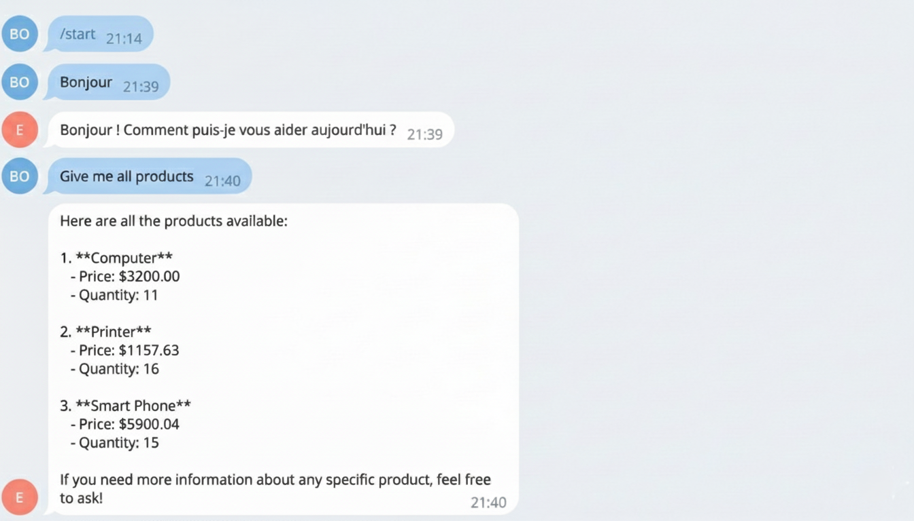

<div align="center">

# Plateforme e-commerce — Monorepo

</div>

## Aperçu

Monorepo comprenant :
- **Frontend Angular** (`ecom-app-frontend-benatik`)
- **Backend microservices Spring Boot** (`ecom-app-backend-benatik`)
- **Chatbot Telegram** (`ecom-app-chatbot-benatik`)
- **Config repo** (`ecom-app-config-repo`)
- **Infra Docker Compose** : Kafka, Zookeeper, Keycloak, Postgres, gateway, discovery, config.

## Prérequis

- Node.js 18+ et npm, Angular CLI (`npm install -g @angular/cli`)
- Java 17+
- Docker & Docker Compose

## Démarrage rapide (stack complète)

```bash
docker compose up -d --build
```

Services principaux (extraits `docker-compose.yml`) :
- Keycloak : `http://localhost:8080`
- Gateway : `http://localhost:8888`
- Discovery : `http://localhost:8761`
- Config : `http://localhost:9999`
- Frontend (Nginx) : `http://localhost:4200`
- Kafka : `9092`, Zookeeper : `2181`

Arrêt :

```bash
docker compose down
```

## Frontend Angular

```bash
cd ecom-app-frontend-benatik
npm install
npm start   # ou ng serve --open
```

## Microservices Spring Boot

Depuis l’IDE ou Maven :

```bash
cd ecom-app-backend-benatik
mvn spring-boot:run -pl <module>
```

Modules clés : config-service, discovery-service, gateway-service, customer-service, supplier-service, inventory-service, billing-service, analytics-service.

## Chatbot Telegram

```bash
cd ecom-app-chatbot-benatik
export OPENAI_API_KEY=...
export TELEGRAM_TOKEN=...
mvn spring-boot:run
```

## Authentification (Keycloak)

Realm import : `keycloak/realm-export.json` (monté automatiquement par Docker).  
Clients principaux :
- `frontend` (public) avec redirections `http://localhost:4200/*` et `http://localhost:8888/*`
- `gateway` (bearer-only)

## Captures (README)

Place les images dans `docs/images/` du frontend ou adapte les chemins.

1. **Bot Telegram — EmsiAIBot** : conversation montrant la liste des produits retournée par le bot.  
   
2. **Services Spring Boot dans IntelliJ** : vue Services affichant les microservices et requêtes GET.  
   
3. **Containers Docker (Keycloak/Kafka/Zookeeper)** : tableau des conteneurs avec ports et consommation.  
   
4. **Interface commande frontend** : tableau récapitulatif d’une commande (produits, quantités, montants).  
   

## Structure

```
Final project/
├─ docker-compose.yml          # orchestration infra + services
├─ ecom-app-frontend-benatik/  # Angular app
├─ ecom-app-backend-benatik/   # microservices Spring Boot
├─ ecom-app-chatbot-benatik/   # bot Telegram
├─ ecom-app-config-repo/       # config Git pour config-service
├─ keycloak/realm-export.json  # realm Keycloak import
└─ kafka_spring_cloud_stream_benatik/ # exemples stream (optionnel)
```

## Notes

- Ajuste les ports/URLs si tu changes l’environnement.
- Mets à jour les captures si tu modifies l’UI, les services ou la configuration.
